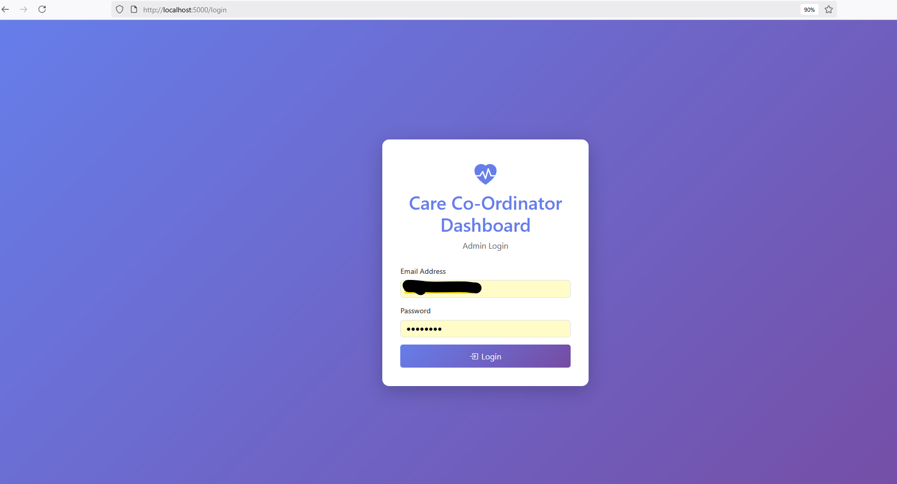
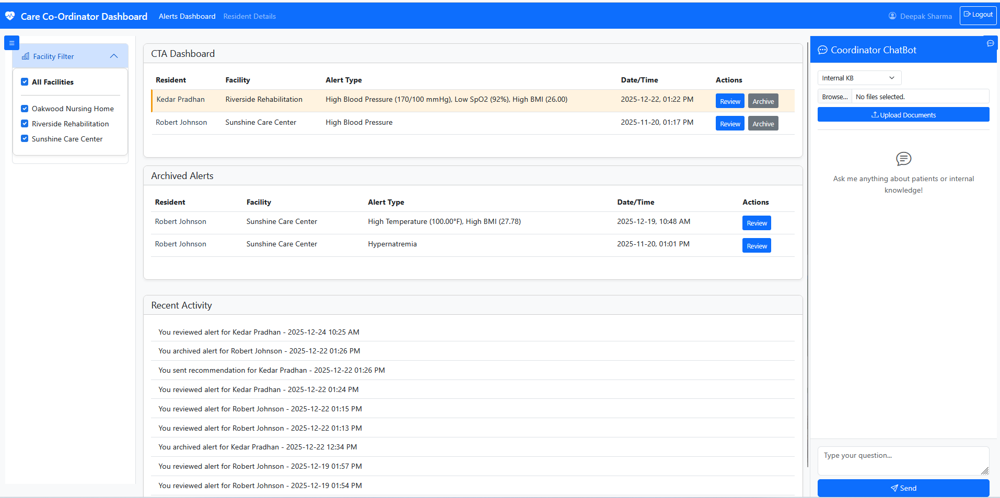
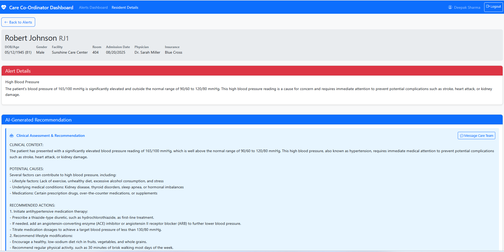
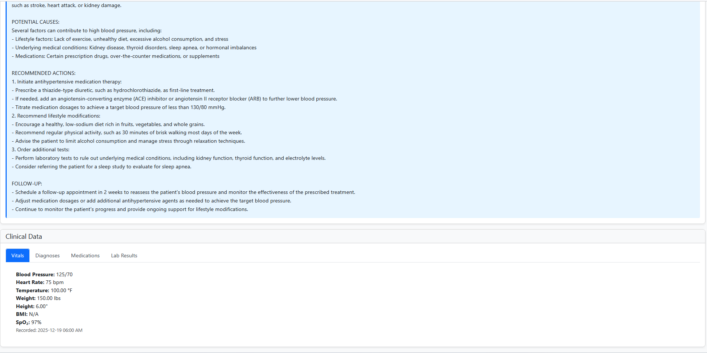
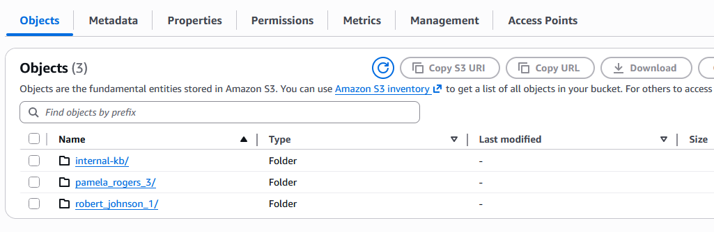
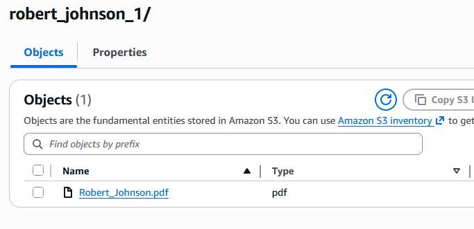
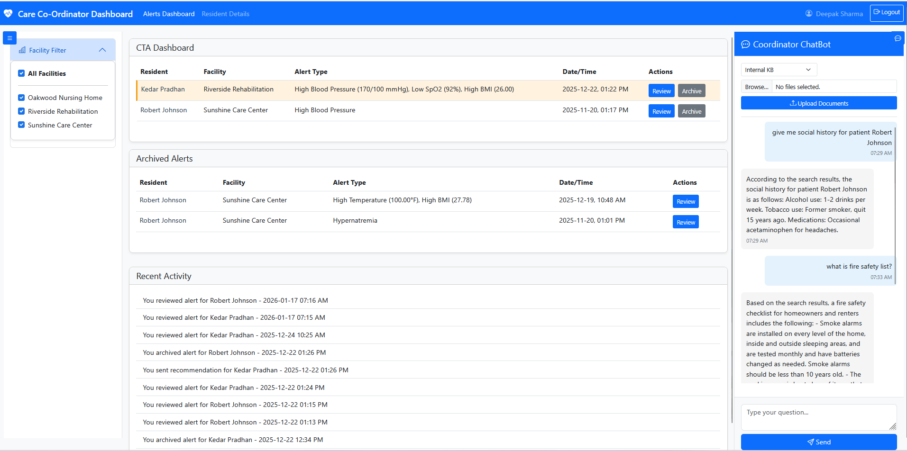

# Care Co-Ordinator System

A Flask-based care coordination system with AI-powered analysis using AWS Bedrock and Knowledge Base integration.

## Features

### 1. Care Coordination System
- **Real-time monitoring** of patient vitals, lab results, and medications
- **AI-powered analysis** using AWS Bedrock Claude model
- **Automatic alert generation** when abnormalities are detected
- **Duplicate prevention** - tracks evaluated data per patient
- **Archive functionality** - organize alerts efficiently

### 2. Dashboard
- **Three-panel layout**: Facility Filter | Alert Dashboard | Chatbot
- **Active alerts** with review and archive options
- **Archived alerts** section for historical reference
- **Recent activity** tracking for administrators
- **Real-time notifications** for new alerts with sound
- **Patient detail views** with clinical data tabs
- **Email integration** for care team communication

### 3. AI Chatbot
- **Knowledge Base integration** using AWS Bedrock
- **Document upload** to Internal KB or patient-specific folders
- **Patient-specific queries** with folder-based organization
- **Real-time chat** interface with typing indicators

## Setup

### Prerequisites
- Python 3.8+
- MySQL database
- AWS account with Bedrock access
- AWS S3 buckets configured

### Installation

1. Install dependencies:
```bash
pip install -r requirements.txt
```

2. Configure environment variables in `.env` (copy from `.env.example`):
```
AWS_REGION=us-east-1
BEDROCK_MODEL_ID=anthropic.claude-3-haiku-20240307-v1:0
BEDROCK_KNOWLEDGE_ID=your_kb_id
BEDROCK_KNOWLEDGE_DATA_SOURCE_ID=your_data_source_id
BEDROCK_KNOWLEDGE_BUCKET_NAME=your_kb_bucket

RDS_HOST=your_db_host
RDS_PORT=3306
RDS_USER=your_db_user
RDS_PASS=your_db_password
RDS_DB=your_database

RECOMMENDATION_BUCKET_NAME=your_recommendation_bucket
ADMIN_ACTIVITY_BUCKET_NAME=your_activity_bucket
SES_SENDER_EMAIL=your_email@example.com
FLASK_SECRET_KEY=your_secret_key
```

3. **Generate a secure Flask secret key**:
```bash
python -c "import secrets; print(secrets.token_hex(32))"
```

4. Set up database:
```bash
# Create the main database tables (you'll need to create these based on the schema above)
mysql -u your_user -p your_database < create_database_schema.sql

# Create the eval table and add alert_archive column
mysql -u your_user -p your_database < create_eval_table.sql
```

4. Run the application:
```bash
python app_flask.py
```

5. Access the dashboard:
```
http://localhost:5000
```

## Database Schema

The Care Co-Ordinator System uses MySQL database with the following tables:

### Core Tables

#### `patient` - Patient Information
```sql
CREATE TABLE patient (
    patient_id INT AUTO_INCREMENT PRIMARY KEY,
    patient_first_name VARCHAR(100) NOT NULL,
    patient_last_name VARCHAR(100) NOT NULL,
    patient_dob DATE,
    patient_gender ENUM('Male', 'Female', 'Other'),
    patient_room VARCHAR(20),
    patient_admission_date DATE,
    patient_insurance VARCHAR(100),
    facility_id INT,
    physician_id INT,
    FOREIGN KEY (facility_id) REFERENCES facility(facility_id),
    FOREIGN KEY (physician_id) REFERENCES physician(physician_id)
);
```

#### `facility` - Healthcare Facilities
```sql
CREATE TABLE facility (
    facility_id INT AUTO_INCREMENT PRIMARY KEY,
    facility_name VARCHAR(200) NOT NULL,
    facility_email VARCHAR(100),
    facility_address TEXT,
    facility_phone VARCHAR(20)
);
```

#### `physician` - Physician Information
```sql
CREATE TABLE physician (
    physician_id INT AUTO_INCREMENT PRIMARY KEY,
    physician_first_name VARCHAR(100) NOT NULL,
    physician_last_name VARCHAR(100) NOT NULL,
    physician_email VARCHAR(100),
    physician_phone VARCHAR(20),
    physician_specialty VARCHAR(100)
);
```

#### `admin` - Administrator Accounts
```sql
CREATE TABLE admin (
    admin_id INT AUTO_INCREMENT PRIMARY KEY,
    admin_first_name VARCHAR(100) NOT NULL,
    admin_last_name VARCHAR(100) NOT NULL,
    admin_email VARCHAR(100) UNIQUE NOT NULL,
    admin_password VARCHAR(255) NOT NULL,
    admin_role ENUM('admin', 'supervisor') DEFAULT 'admin',
    created_at TIMESTAMP DEFAULT CURRENT_TIMESTAMP
);
```

### Clinical Data Tables

#### `vitals_data` - Patient Vital Signs
```sql
CREATE TABLE vitals_data (
    vitals_id INT AUTO_INCREMENT PRIMARY KEY,
    patient_id INT NOT NULL,
    blood_pressure VARCHAR(20),
    heart_rate INT,
    temperature DECIMAL(4,1),
    weight DECIMAL(5,1),
    height DECIMAL(5,1),
    BMI DECIMAL(4,1),
    spo2 INT,
    vitals_date_time DATETIME NOT NULL,
    recorded_by VARCHAR(100),
    FOREIGN KEY (patient_id) REFERENCES patient(patient_id) ON DELETE CASCADE,
    INDEX idx_patient_datetime (patient_id, vitals_date_time)
);
```

#### `lab_result` - Laboratory Test Results
```sql
CREATE TABLE lab_result (
    lab_id INT AUTO_INCREMENT PRIMARY KEY,
    patient_id INT NOT NULL,
    sodium DECIMAL(5,2),
    potassium DECIMAL(5,2),
    BUN DECIMAL(5,1),
    creatinine DECIMAL(4,2),
    glucose DECIMAL(5,1),
    lab_date_time DATETIME NOT NULL,
    lab_technician VARCHAR(100),
    lab_notes TEXT,
    FOREIGN KEY (patient_id) REFERENCES patient(patient_id) ON DELETE CASCADE,
    INDEX idx_patient_datetime (patient_id, lab_date_time)
);
```

#### `medication` - Medication Records
```sql
CREATE TABLE medication (
    medication_id INT AUTO_INCREMENT PRIMARY KEY,
    patient_id INT NOT NULL,
    medication_name VARCHAR(200) NOT NULL,
    medication_dose VARCHAR(100),
    medication_frequency VARCHAR(100),
    medication_route VARCHAR(50),
    medication_date_time DATETIME NOT NULL,
    prescribed_by VARCHAR(100),
    medication_notes TEXT,
    FOREIGN KEY (patient_id) REFERENCES patient(patient_id) ON DELETE CASCADE,
    INDEX idx_patient_datetime (patient_id, medication_date_time)
);
```

### Alert Management Tables

#### `alert` - Generated Alerts
```sql
CREATE TABLE alert (
    alert_id INT AUTO_INCREMENT PRIMARY KEY,
    patient_id INT NOT NULL,
    facility_id INT,
    alert_type VARCHAR(500) NOT NULL,
    alert_detail TEXT,
    alert_date_time DATETIME DEFAULT CURRENT_TIMESTAMP,
    alert_archive TINYINT DEFAULT 0,
    alert_severity ENUM('Low', 'Medium', 'High', 'Critical') DEFAULT 'Medium',
    reviewed_by INT,
    reviewed_at DATETIME,
    FOREIGN KEY (patient_id) REFERENCES patient(patient_id) ON DELETE CASCADE,
    FOREIGN KEY (facility_id) REFERENCES facility(facility_id),
    FOREIGN KEY (reviewed_by) REFERENCES admin(admin_id),
    INDEX idx_patient_datetime (patient_id, alert_date_time),
    INDEX idx_facility_archive (facility_id, alert_archive),
    INDEX idx_archive_datetime (alert_archive, alert_date_time)
);
```

#### `eval` - Evaluation Tracking
```sql
CREATE TABLE eval (
    eval_id INT AUTO_INCREMENT PRIMARY KEY,
    patient_id INT NOT NULL,
    lab_last_date_time DATETIME DEFAULT NULL,
    medication_last_date_time DATETIME DEFAULT NULL,
    vitals_last_date_time DATETIME DEFAULT NULL,
    last_eval_time DATETIME DEFAULT CURRENT_TIMESTAMP ON UPDATE CURRENT_TIMESTAMP,
    UNIQUE KEY unique_patient (patient_id),
    FOREIGN KEY (patient_id) REFERENCES patient(patient_id) ON DELETE CASCADE
);
```

### Key Indexes and Constraints

- **Primary Keys**: All tables have auto-incrementing primary keys
- **Foreign Keys**: Maintain referential integrity between related tables
- **Unique Constraints**: Prevent duplicate admin emails and patient evaluations
- **DateTime Indexes**: Optimize queries for time-based data retrieval
- **Composite Indexes**: Improve performance for patient-specific queries

### Data Relationships

- **Patient → Facility**: Many-to-one (patients belong to facilities)
- **Patient → Physician**: Many-to-one (patients have primary physicians)
- **Patient → Clinical Data**: One-to-many (patients have multiple vitals, labs, medications)
- **Patient → Alerts**: One-to-many (patients can have multiple alerts)
- **Patient → Eval**: One-to-one (each patient has one evaluation tracking record)
- **Alert → Admin**: Many-to-one (alerts can be reviewed by admins)

## Database Schema

## Architecture

### Alert Generation Flow
1. Background monitor checks every 60 seconds
2. Compares latest data timestamps with eval table
3. If new data detected, sends last 30 days to Bedrock
4. AI analyzes and generates alerts for abnormalities
5. Saves recommendations to S3
6. Updates eval table with latest timestamps

### Chatbot Flow
1. Documents uploaded to S3 (internal-kb/ or patient folders)
2. Knowledge Base synced automatically
3. User queries sent to Bedrock with KB context
4. AI responds based only on uploaded documents

## S3 Structure

```
your-kb-bucket/
├── internal-kb/
│   └── [general documents]
└── {firstname}_{lastname}_{patientid}/
    └── [patient-specific documents]

your-recommendation-bucket/
└── {alert_id}_{patient_id}_recommendation.txt

your-admin-activity-bucket/
└── {admin_id}.txt
```

## Key Files

- `app_flask.py` - Main Flask application
- `utils.py` - Utility functions (S3, SES, database)
- `create_database_schema.sql` - Complete database schema setup
- `create_eval_table.sql` - Evaluation table and alert archive column
- `static/js/dashboard.js` - Frontend JavaScript
- `static/css/styles.css` - Styling
- `templates/dashboard.html` - Main dashboard template
- `templates/login.html` - Admin login page

## Features in Detail

### Care Coordination System
- Strict threshold checking for all vital signs and lab values
- Independent tracking per data source (vitals, labs, meds)
- Prevents duplicate alerts for same condition using keyword matching
- Archives old alerts to keep dashboard clean
- Real-time popup notifications for new alerts
- Email notifications to care team with clinical recommendations
- Background monitoring thread runs independently of web interface

### Chatbot
- Upload PDFs, DOCX, TXT files to S3 knowledge base
- Automatic KB synchronization (twice with 10s delay)
- Patient folder naming: `firstname_lastname_id`
- Answers only from uploaded documents (no general knowledge)
- Real-time typing indicators and message timestamps
- Toggle-able chatbot panel interface

## Development

The application uses:
- **Flask** for web framework
- **boto3** for AWS services
- **pymysql** for database connectivity
- **python-dotenv** for environment variable management
- **Bootstrap 5** for UI components
- **JavaScript** for frontend interactivity

## Security Considerations

⚠️ **IMPORTANT**: This project contains several security considerations that must be addressed before deployment:

### Before GitHub Upload:
1. **Never commit the `.env` file** - It contains sensitive credentials
2. **Use `.env.example`** - Copy and rename to `.env`, then fill with your actual values
3. **Review all code** - Ensure no hardcoded credentials or sensitive data

### SQL Injection Prevention:
The current codebase uses string formatting for SQL queries which creates SQL injection vulnerabilities. Before production use:
1. Replace all f-string SQL queries with parameterized queries
2. Use prepared statements with parameter binding
3. Validate and sanitize all user inputs

### Production Security:
- Use strong, unique passwords for all accounts
- Enable AWS IAM roles instead of access keys where possible
- Implement proper input validation and sanitization
- Use HTTPS in production
- Regularly update dependencies
- Implement proper logging and monitoring

## Additional Features

### Security & Authentication
- Admin login system with session management
- Secure password-based authentication
- Session-based access control for all endpoints

### Real-time Monitoring
- Background thread monitors for new data every 60 seconds
- Frontend polls for new alerts and updates display automatically
- Audio notifications for critical alerts

### Data Management
- Comprehensive patient data tracking (vitals, labs, medications)
- Facility-based filtering and organization
- Historical data archiving and retrieval

### AWS Integration
- **Bedrock**: AI analysis and knowledge base queries
- **S3**: Document storage and recommendation archiving
- **SES**: Email notifications to care teams
- **Bedrock Agent**: Knowledge base synchronization

## API Endpoints

### Authentication
- `GET /` - Redirect to login or dashboard
- `GET /login` - Admin login page
- `POST /login` - Process login credentials
- `GET /logout` - Logout and clear session

### Dashboard
- `GET /dashboard` - Main dashboard interface
- `GET /api/facilities` - Get all facilities
- `GET /api/alerts` - Get active alerts with pagination
- `GET /api/archived-alerts` - Get archived alerts
- `GET /api/activities` - Get admin activity history

### Patient Data
- `GET /api/patient/<id>` - Get patient details
- `GET /api/alert/<id>` - Get alert details
- `GET /api/recommendation/<id>` - Get AI recommendation
- `GET /api/vitals/<id>` - Get patient vitals
- `GET /api/medications/<id>` - Get patient medications
- `GET /api/labs/<id>` - Get patient lab results

### Alert Management
- `POST /api/archive-alert` - Archive an alert
- `POST /api/send-email` - Send email to care team
- `POST /api/log-review` - Log alert review activity
- `GET /api/check-new-alerts` - Check for new alerts

### Chatbot
- `GET /api/chatbot/patients` - Get patients for chatbot
- `POST /api/chatbot/upload` - Upload documents to knowledge base
- `POST /api/chatbot/query` - Query knowledge base

## So how does it work?

- First login using admin credential email and password which are stored in admin table.



- You will land on main dashboard where you will see past alerts and archived alert along with admin activity logs at bottom. On left panel you can filter alert based on facilities for those perticular patients. On right panel you will have file upload feature with chatbot to interact with patient data and other knowledge base artifacts stored in S3 bucket.



- You can view perticular alert by clicking preview button which will take you resident dashboard. You can archive the alert by clicking Archive button.





- On right panel you can use file upload feature to upload patient test result or report by choosing first patient from drop down and browse your file location to upload. This will upload the file with patient name and ID as filename to the S3 bucket within patient name folder. Same way if you want to upload any other artifacts as knowledge base you can choose internal-KB from drop down and upload file which will saved in the same same bucket but under internal-kb folder in S3. The entire bucket is used as knowledge base for RAG processing to use with chatbot. Whenever you upload any file, it will automatically check the status of file upload operation and sync the knowledge base data source. So you will always have upto date information in chatbot.





- On chatbot you can ask any question regarding patient records and any other information which will be fetched from knowledge base we configured with S3 bucket.



## License

Proprietary - All rights reserved